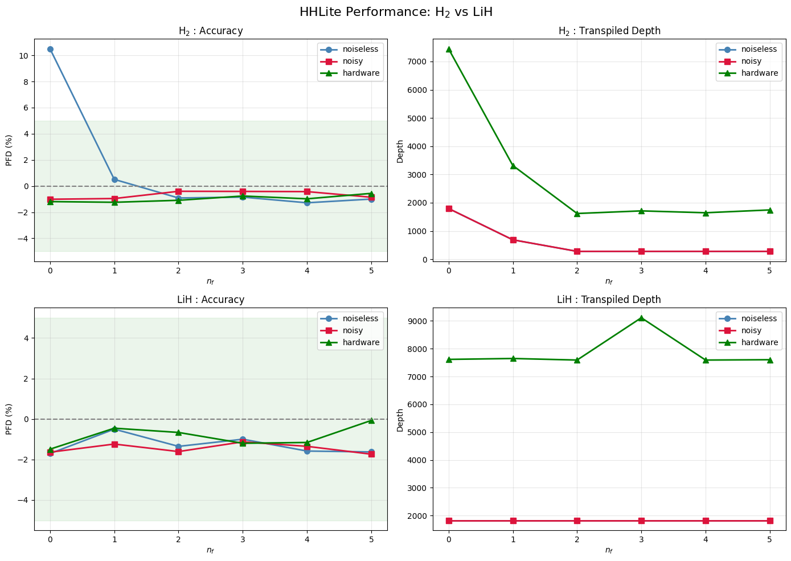
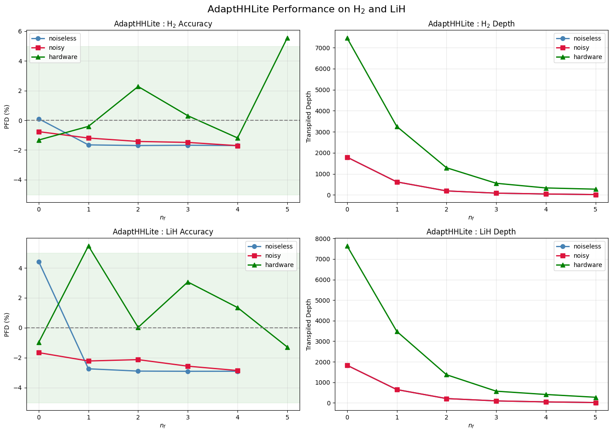

# Adapting the HHL Algorithm to Quantum Many-Body Theory

Implementation and benchmarking of the **HHL, HHLite, and AdaptHHLite**
algorithms for solving linear systems arising in quantum many-body theory.

## Overview

The Harrow-Hassidim-Lloyd (HHL) algorithm provides a quantum approach to
solving linear systems of equations. In this project, the linearized
coupled-cluster formulation of quantum chemistry is mapped to a quantum
linear system, allowing molecular correlation energies to be estimated
from the resulting solution.

The project implements and studies two resource-efficient variants of
HHL:

- **HHLite** — reduces circuit complexity by fixing QPE clock qubits whose
  measurement probabilities are sufficiently biased.
- **AdaptHHLite** — combines the Lite procedure with a matrix-rescaling
  scheme to enable more effective qubit fixing.

The implementations are tested on reduced molecular Hamiltonians for
**H₂ and LiH**.

## Methods

The algorithms were implemented using **Qiskit** and evaluated under:

- Noiseless quantum simulation
- Noisy simulation using a depolarizing noise model
- Execution on IBM quantum hardware

Performance was evaluated using circuit depth, entangling-gate count,
runtime, and percentage deviation of the estimated correlation energy
from the reference value.

## Results

### HHLite

For H₂, the multi-qubit fixing procedure substantially reduces circuit
depth while maintaining accurate correlation-energy estimates.



For LiH, the QPE clock-qubit probabilities remain insufficiently biased
for effective fixing, limiting the circuit-depth reduction.

### AdaptHHLite

Matrix rescaling enables substantially more aggressive qubit fixing,
including for the LiH system.

For H₂, the transpiled circuit depth decreases from

**101 → 52 → 27 → 14 → 7**

as additional clock qubits are fixed, corresponding to approximately
**93% circuit-depth reduction** at four fixed qubits while maintaining
an energy error below 2%.



Across H₂ and LiH, substantial reductions in transpiled circuit depth
and entangling-gate count were observed in noiseless simulation, noisy
simulation, and IBM hardware executions.

## Repository Structure

```text
├── notebooks/
│   └── HHL_Quantum_Many_Body.ipynb
├── figures/
│   ├── hhlite-results.png
│   └── adapthhlite-results.png
└── report/
    └── HHL_Quantum_Many_Body_Theory.pdf
